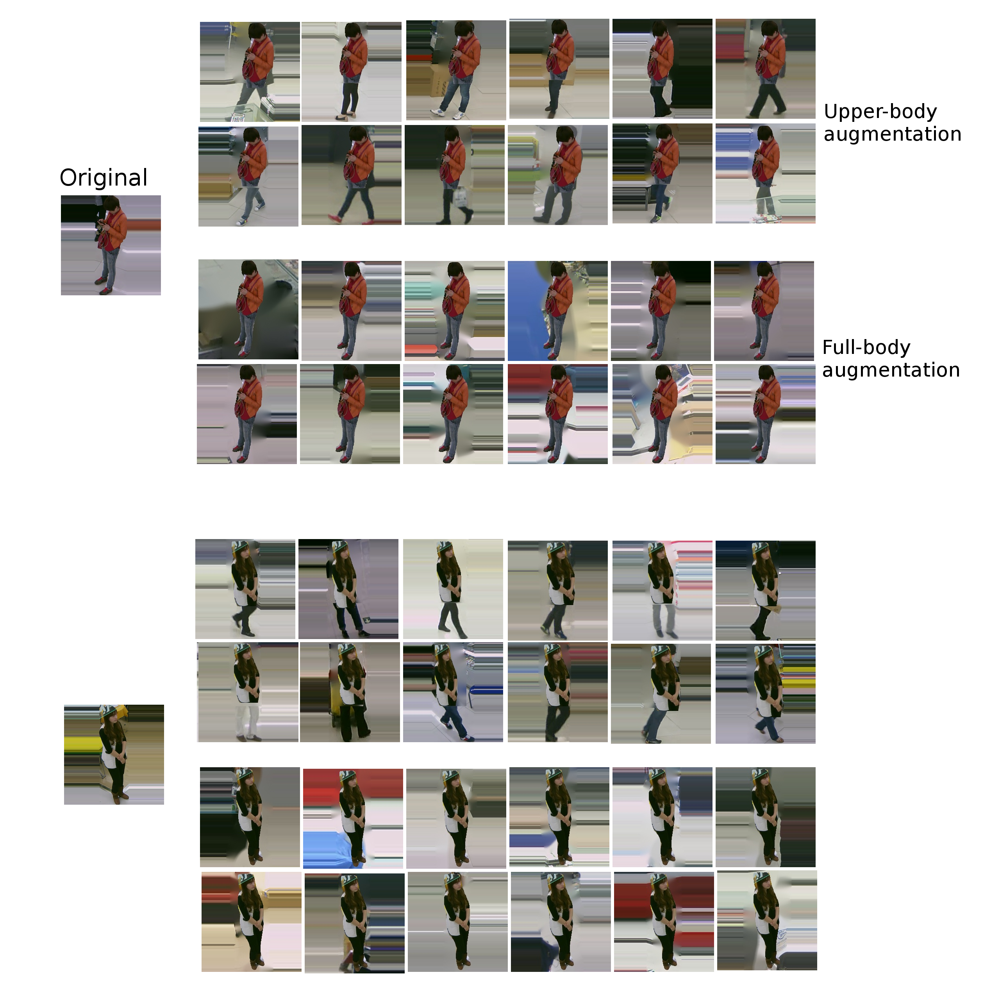
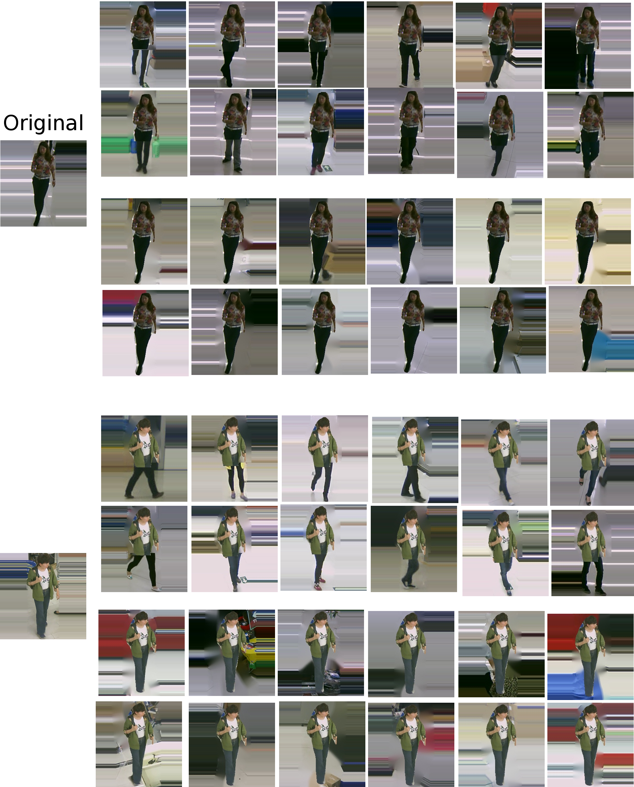

# Implicit Attention Mechanism Data Augmentation:
CNNs are able to autonomously find the critical regions of the input data and discriminate between foreground and background features. However, they demand huge volumes of data, which can be hard to collect and (particularly) annotate for usage in supervised tasks. In this paper, we develop an augmentation technique that empowers the network to improve this autonomous \emph{discovery skill}.

# Paper:
An Implicit Attention Mechanism for Deep Learning Pedestrian Re-identification Frameworks.
Paper link at arxiv (https://arxiv.org/)
* This project is is a forked version of https://github.com/michuanhaohao/reid-strong-baseline

## The proposed attention mechanism:

## Samples:
Examples of the generated images are as follows. The first two rows show the fake samples with attention on the upper-body, the 3th and 4th rows show the fakes samples with attention on the full-body.
When enabling the attention on the upper-body region, fake samples are different in the human lower-body and the environment, while they resemble each other in the person's upper-body and identity label. By selecting the full-body as the Region of Interest, the generated images will be composed of similar body silhouettes with different surroundings.

## Comparison results on the Richly Annotated Pedestrian (RAP) dataset is as follows:

