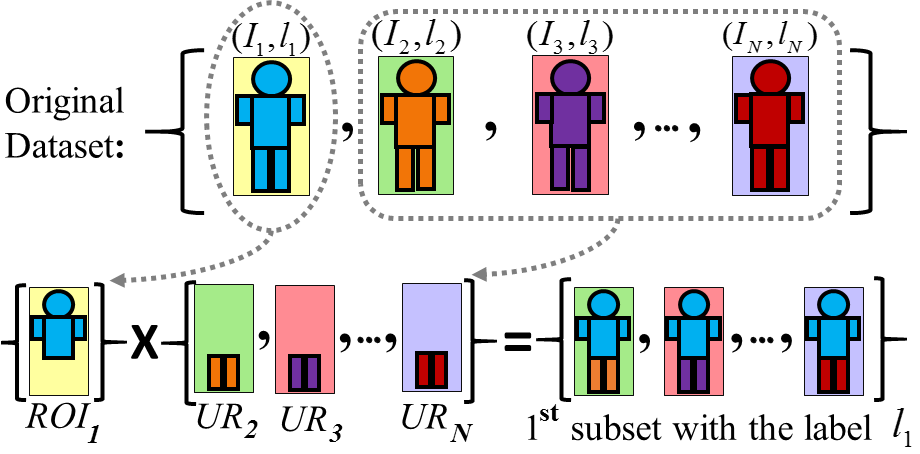
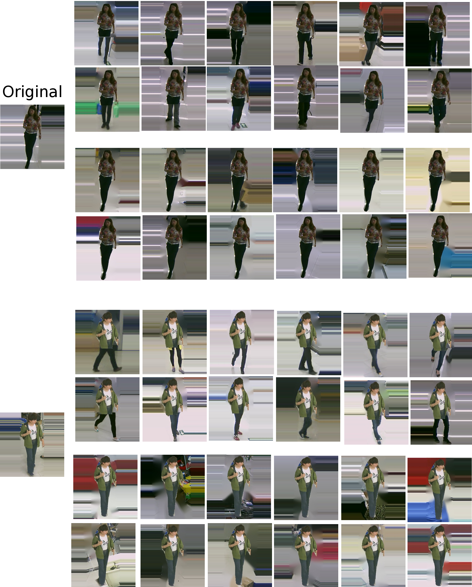
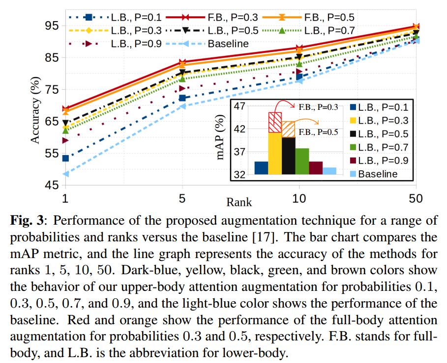
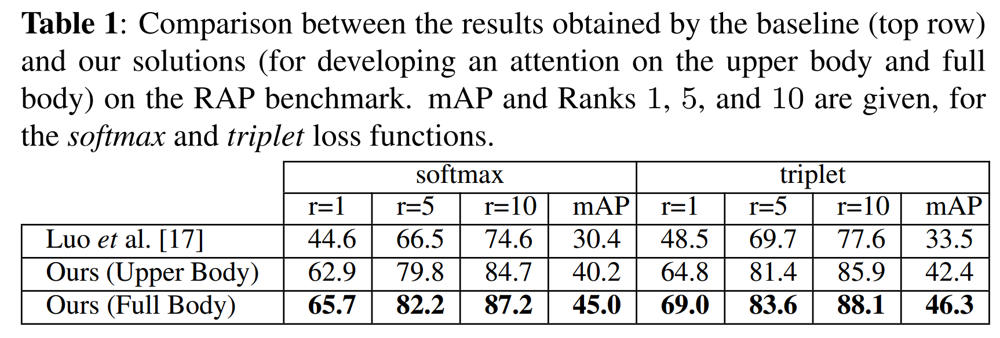

# Implicit Attention Mechanism Data Augmentation

An Implicit Attention Mechanism for Deep Learning Pedestrian Re-identification Frameworks. ICIP2020, (Submitted).
Paper link at arxiv [[https://to_be_insert_soon]](https://arxiv.org/)

* This project is is a forked version of https://github.com/michuanhaohao/reid-strong-baseline

## The proposed attention mechanism:

## Examples of generated images when developing the attention on upper-body (First two rows)/full-body (3th and 4th rows)

## Comparison results on RAP dataset is as follows:

